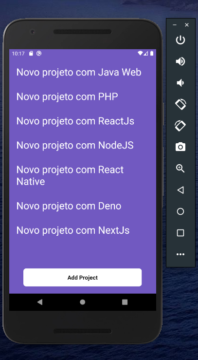

# Mobile com React Native

Going to the mobile world, knowing some concepts of React Native, and developing our first application that gonna connect with our back-end.

## How to run

1. `git clone` this repository
2. Dependencies
  2.1 Make sure you have `yarn` installed
  2.2 Make sure you have `React Native CLI` installed globaly
  2.3 Make sure you have `Java JDK 8` installed https://react-native.rocketseat.dev/
  2.4 Make sure you have an Android or IOS emulator installed and running https://react-native.rocketseat.dev/
3. Make sure you have `API` from https://github.com/ivanvinicius/2020-bootcamp-backend-com-nodejs downloaded and running
4. Inside the project folder access `src/services/api.js` and change de `baseURL` for your current API adress and port 
5. Inside project folder run the command `$ yarn` to download dependencies
6. Install the project on emulator with `$ react-native run-(OS)` 
7. Run `$ react-native start` to start `metro bundler` and open the application on device

OBS.: You can also run this project in a real device running IOS or Android

## Project Overview

### keep coding!